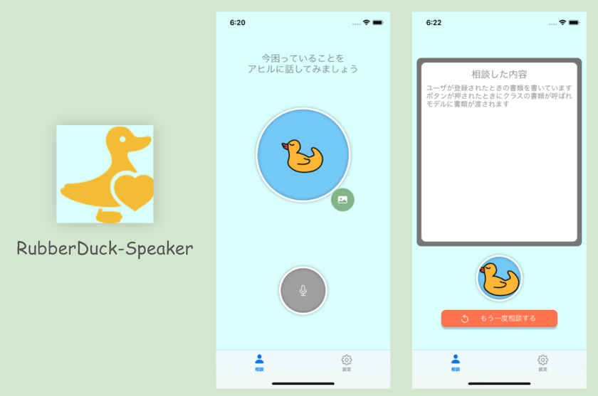
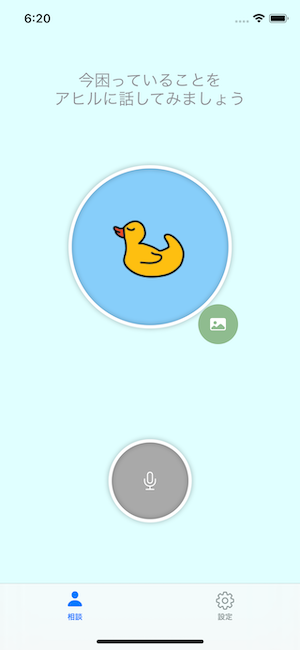
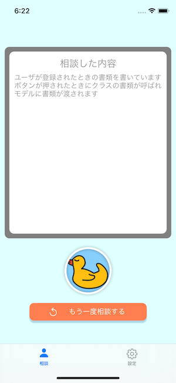

# RubberDuck-Speaker

## このアプリについて

◆ ◆ ◆ このアプリの特徴 ◆ ◆ ◆

コードを書いている時やロジックを1人で考えている時、行き詰まることがありませんか？

そんな時に有効なデバッグ方法として、**ラバーダック・デバッグ**という手法をご存知ですか？

今自分が書こう、もしくは書いたコードをオモチャのアヒルに説明をすることで頭の整理が出来てデバッグするという手法です。

このラバーダック・デバッグを、手元にアヒルちゃんが居なくても出来るようにしたのが、RubberDuck-Speakerです。

## スクリーンショット

## アーキテクチャ

アプリ全体のアーキテクチャは、SwiftUIのアプリを設計するに当たって有力とされている[ELMアーキテクチャ](https://guide.elm-lang.org/architecture/)をベースに、下の図のような設計で実装を行なっています。

画像参照元：https://nalexn.github.io/clean-architecture-swiftui/

参考記事：https://nalexn.github.io/clean-architecture-swiftui/

## Credentials

All of icons in this app from [Icon8](https://icons8.com/)